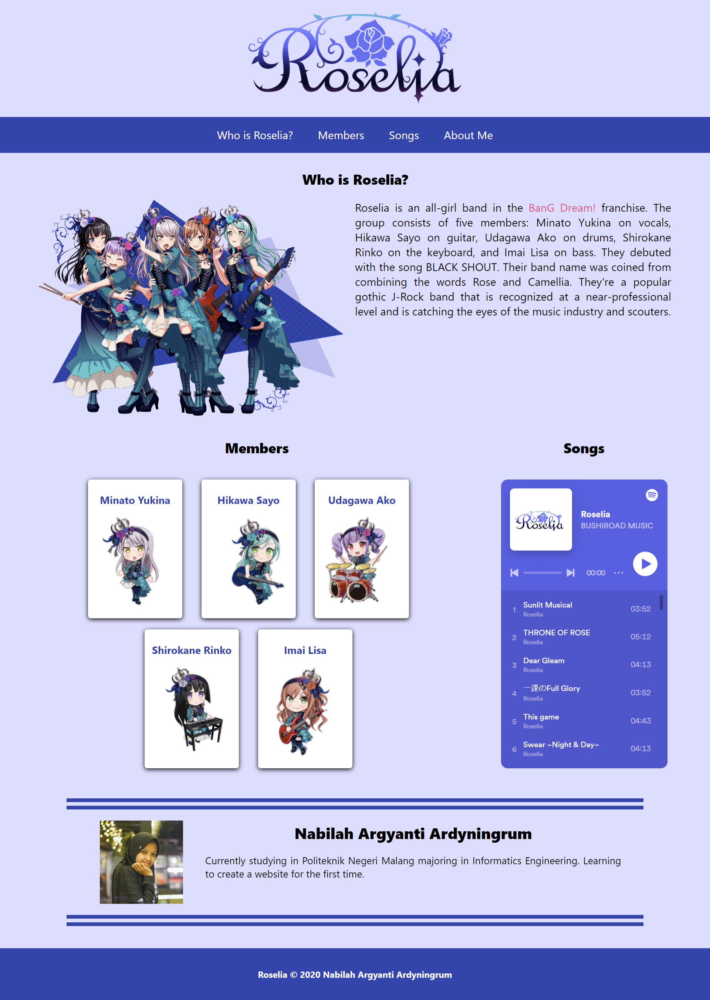

# Introduction to Roselia from BanG Dream

This project is the result of the submission for the [Belajar Dasar Pemrograman Web](https://www.dicoding.com/academies/123) course at Dicoding. It's a website that introduces Tuyu.

## Features

- Utilizes HTML, CSS, and JavaScript to create an interactive web page.
- Introduces who Roselia is and its members.
- Lists Roselia's songs from Spotify.

## Technologies Used

- HTML
- CSS
- JavaScript

## Screenshots

