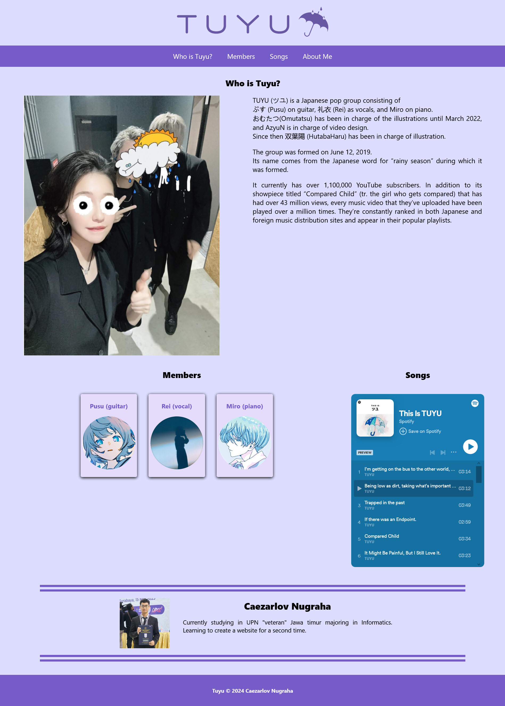

# Introduction to Tuyu

This project is the result of the submission for the [Belajar Dasar Pemrograman Web](https://www.dicoding.com/academies/123) course at Dicoding. It's a website that introduces Tuyu.

## Features

- Utilizes HTML, CSS, and JavaScript to create an interactive web page.
- when you press the members picture it will bring you to their social page
- when you hover over the members picture it will show what social they use. so you'll know where you're getting directed to
- Introduces who Tuyu is and its members.
- Lists Tuyu's songs from Spotify.

## Technologies Used

- HTML
- CSS
- JavaScript

## Screenshots

